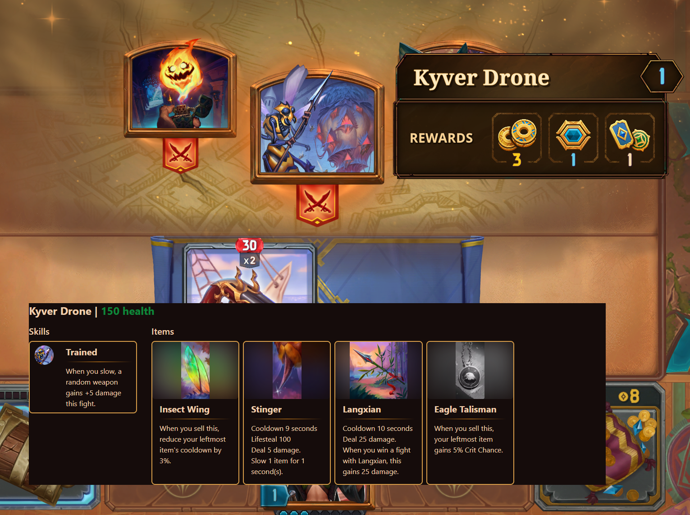

# Show Combat Encounter Detail
This mod shows combat encounter information when hovering them :
- Health
- Skills
- Items & item description  

The images are programmatically taken screenshots of the encounter details on 
[howbazaar.gg](https://www.howbazaar.gg/monsters)
## Install
### Mod loader
If you already have bepinex installed, skip this section.
  1. Download [The latest version of BepInEx 5](https://github.com/BepInEx/BepInEx/releases/download/v5.4.23.2/BepInEx_win_x64_5.4.23.2.zip)  
   2. Extract in the games root folder (`<Tempo Launcher -> Settings -> Game Installation Directory>/bazaarwinprodlatest/`)
   3. **If the toolips do not show after installation**, in `BepInEx\config\BepInEx.cfg`, set `HideManagerGameObject = true` (it should be near the top)
### Mod Install
  1. Download the [latest release](https://github.com/nwk6661/Bazaar-SCED-Bepin5/releases) (not the source code)  
  2. Extract it in `<your game install>\BepInEx\plugins`. you should see a folder named `ShowCombatEncounterDetail`

## Configuration
After launching the game at least once with the mod installed, you should have a new configuration file at `BepInEx\config\ShowCombatEncounterDetail.cfg`  
Here you can roughly change where the new tooltip appears as a ratio relative to the center of the screen. For example,
the default values `[0,-.125]` for the X and Y parameters respectively put the image centered on the horizontal axis
and roughly over your items on the vertical axis. The example screenshot is a value of `-.25`.  
_Restart the game after changing these values for them to take effect._

## Uninstall
Delete the `BepInEx\plugins\ShowCombatEncounterDetail` folder in your game files.

## Examples

## Planned
Color the flavor text for keywords (e.g. slow, damage, haste, ...) in item descriptions to match the colors in game for better readability

## Credits
[infarctus](https://github.com/Infarcactus/) for original mod implementation  
[howbazaar.gg](https://www.howbazaar.gg/) for data  
